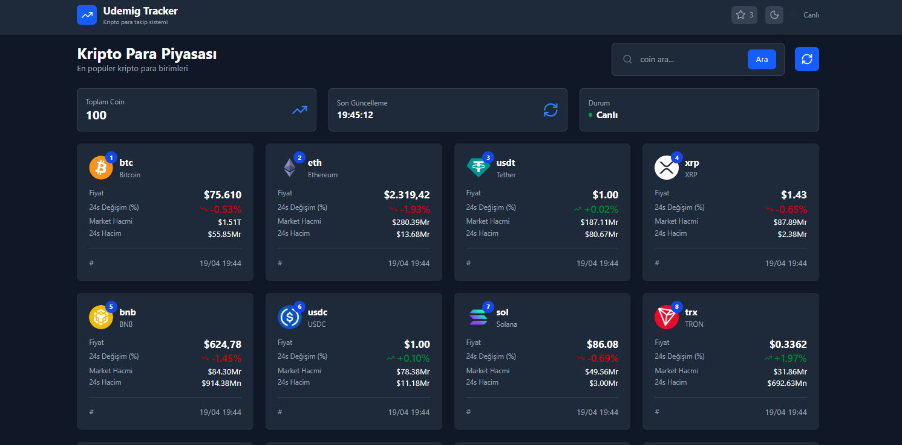
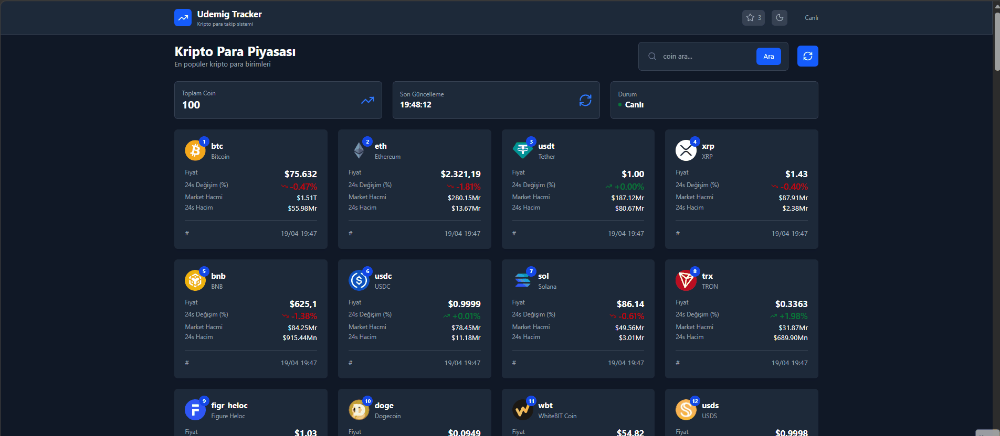

<h1 align="center">📈 Crypto Tracker</h1>

React ve modern frontend teknolojileri kullanılarak geliştirilmiş,
kripto para verilerini anlık olarak takip etmeye olanak sağlayan
modern ve responsive bir <strong>Crypto Tracking Application</strong>.

<h2>📌 Proje Amacı</h2>

Bu proje, React ekosistemi içerisinde API kullanımı, state yönetimi,
custom hook yapısı ve component mimarisini pratiğe dökmek amacıyla geliştirilmiştir.
Gerçek zamanlı kripto para verilerini kullanıcı dostu bir arayüzle sunar.

<ul>
<li>Kripto para listeleme</li>
<li>Detay sayfası (coin bazlı)</li>
<li>API entegrasyonu (CoinGecko)</li>
<li>Gerçek zamanlı veri çekme</li>
<li>Dark / Light tema yönetimi (Context API)</li>
<li>Responsive modern UI</li>
<li>Custom hook kullanımı</li>
</ul>

<h2>🛠 Kullanılan Teknolojiler</h2>

<ul>
<li>React (Vite)</li>
<li>React Router DOM</li>
<li>Context API (Theme Management)</li>
<li>Custom Hooks</li>
<li>TailwindCSS</li>
<li>Axios</li>
<li>CoinGecko API</li>
</ul>

<h2>✨ Öne Çıkan Özellikler</h2>

<ul>
<<li>📈 Kripto para listeleme ve detay görüntüleme</li>
<li>🔄 API üzerinden dinamik veri çekme</li>
<li>🌙 Dark / Light mode toggle</li>
<li>⚡ Hızlı ve optimize edilmiş yapı (Vite)</li>
<li>🧩 Component tabanlı mimari</li>
<li>📱 Tam responsive tasarım</li>
<li>🔁 Veri yenileme (refresh) sistemi</li>
</ul>

<h2>📂 Proje Yapısı</h2>

<pre>
crypto-tracker/
│
├── public/
│   ├── logo.png
│   ├── robots.txt
│   ├── sitemap.xml
│   └── vite.svg
│
├── src/
│   ├── components/
│   ├── context/
│   ├── hooks/
│   ├── pages/
│   ├── utils/
│   ├── App.jsx
│   ├── index.css
│   └── main.jsx
│
├── .env.example
├── index.html
├── package.json
├── vite.config.js
├── image.png
└── image.gif
</pre>

<h2>📸 Proje Önizleme</h2>

<h2>🎥 Demo (GIF)</h2>

<h2>🚀 Kurulum</h2>

Projeyi klonlayın:

<pre>
git clone https://github.com/kenansonmez1617-hub/crypto-tracker.git
</pre>

Proje dizinine gidin:

<pre>
cd crypto-tracker
</pre>

Bağımlılıkları yükleyin:

<pre>
npm install
</pre>

Projeyi çalıştırın:

<pre>
npm run dev
</pre>

Tarayıcıda <strong>http://localhost:5173</strong> adresine giderek projeyi görüntüleyebilirsiniz.

<h2>🔮 Geliştirilebilir Özellikler</h2>

<ul>
<li>Favori coin sistemi ⭐</li>
<li>Grafik entegrasyonu (Chart.js / Recharts)</li>
<li>Arama debounce (API limit azaltma)</li>
<li>Pagination veya infinite scroll</li>
<li>Global state management (Redux / Zustand)</li>
</ul>

<h2>👨‍💻 Geliştirici</h2>

<strong>Kenan Sönmez</strong> 
Frontend Developer

GitHub: 
<a href="https://github.com/kenansonmez1617-hub" target="_blank">
https://github.com/kenansonmez1617-hub
</a>

LinkedIn: 
<a href="https://www.linkedin.com/in/kenan-sonmez" target="_blank">
https://www.linkedin.com/in/kenan-sonmez
</a>

<h2>📄 Lisans</h2>

Bu proje eğitim ve portfolyo amaçlı geliştirilmiştir.
İncelenebilir ve geliştirilebilir.

⭐ Projeyi beğendiyseniz GitHub üzerinden yıldız bırakabilirsiniz.

